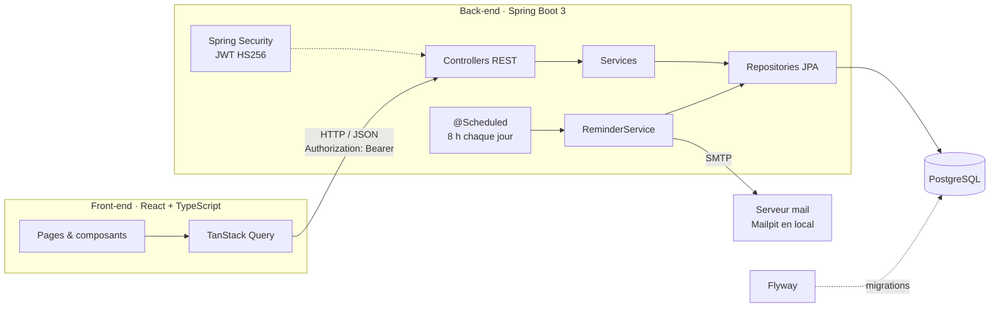

# ApplyTrack

[](https://github.com/Walidee27/ApplyTrack/actions/workflows/ci.yml)

Application web pour **suivre ses candidatures de stage et d'alternance** : un tableau kanban où chaque candidature avance de colonne en colonne, de l'envoi jusqu'à l'offre.

### 👉 [Essayer la démo en ligne](https://applytrack-chi.vercel.app)

Clique sur **« Essayer avec le compte démo »** : aucune inscription n'est nécessaire. Les données sont fictives et réinitialisées chaque nuit.

> ⏳ L'API est hébergée sur une offre gratuite : si elle a été mise en veille, la première connexion peut prendre une minute, le temps que le serveur redémarre.

## ✨ Fonctionnalités

- **Comptes utilisateurs** : inscription, connexion, authentification sans état par JWT.
- **Kanban** : colonnes Envoyée → Relancée → Entretien → Offre / Refusée, avec **glisser-déposer**. La carte change de colonne tout de suite et revient à sa place si le serveur refuse le changement.
- **Candidatures** : entreprise, poste, lieu, lien de l'offre, date, notes. Chaque carte indique depuis combien de jours elle n'a pas bougé.
- **Relances automatiques** : chaque matin, une tâche planifiée envoie **un seul e-mail récapitulatif** par utilisateur, qui liste les candidatures restées sans réponse au-delà du délai qu'il a choisi (7 jours par défaut, désactivable). Une candidature n'est relancée qu'une fois par période sans changement. Les cartes concernées portent un badge « À relancer ».
- **Tableau de bord** : taux de réponse, taux d'entretien, délai moyen avant la première réponse, candidatures envoyées par semaine sur 12 semaines et répartition par statut. Les calculs s'appuient sur l'**historique complet des changements de statut** : une candidature passée en entretien puis revenue en relance compte bien comme une réponse.
- **Cloisonnement des données** : un utilisateur ne peut ni lire ni modifier les candidatures d'un autre. C'est vérifié par des tests.
- **Documentation d'API** générée automatiquement (Swagger UI).

## 🏗️ Architecture



Le back est découpé par fonctionnalité (`auth`, `user`, `jobapplication`, `reminder`, `stats`), avec dans chaque paquet les couches controller → service → repository et des DTO dédiés. Les entités JPA ne sortent jamais de l'API. Les erreurs suivent le format standard **RFC 9457** (`ProblemDetail`). Les statistiques sont calculées par une classe pure (`StatsCalculator`), sans accès à la base, ce qui permet de la tester unitairement.

## 🛠️ Stack

| | |
|---|---|
| **Front-end** | React 19, TypeScript, Vite, TanStack Query, React Router, dnd-kit, Tailwind CSS |
| **Back-end** | Java 21, Spring Boot 3.5 (Web, Data JPA, Security, OAuth2 Resource Server, Validation, Mail, Scheduling), springdoc-openapi |
| **Base de données** | PostgreSQL 17, migrations Flyway |
| **Tests** | JUnit 5, MockMvc, **Testcontainers** (vraie base PostgreSQL), Vitest, Testing Library |
| **Outillage** | Docker, Docker Compose, GitHub Actions, oxlint |

## 🚀 Lancer le projet en local

Prérequis : **Java 21**, **Node.js 24** et **Docker**. Maven n'est pas nécessaire : le projet embarque le Maven Wrapper (`mvnw`).

```bash
# 1. Base de données + serveur mail de test (e-mails visibles sur http://localhost:8025)
docker compose up -d db mailpit

# 2. API (http://localhost:8080, doc sur /swagger-ui.html)
cd backend
./mvnw spring-boot:run

# 3. Front-end (http://localhost:5173)
cd frontend
npm install
npm run dev
```

Variables d'environnement de l'API (toutes ont une valeur par défaut pour le développement) :

| Variable | Rôle |
|---|---|
| `DATABASE_URL`, `DATABASE_USER`, `DATABASE_PASSWORD` | Connexion PostgreSQL |
| `JWT_SECRET` | Clé de signature des jetons, **32 caractères minimum**, obligatoire en production |
| `JWT_EXPIRATION` | Durée de validité des jetons (ISO-8601, `PT24H` par défaut) |
| `CORS_ALLOWED_ORIGINS` | URL(s) du front autorisées |
| `MAIL_HOST`, `MAIL_PORT`, `MAIL_USERNAME`, `MAIL_PASSWORD`, `MAIL_SMTP_AUTH`, `MAIL_STARTTLS` | Serveur SMTP (Mailpit sur `localhost:1025` par défaut) |
| `MAIL_FROM`, `FRONTEND_URL` | Expéditeur des e-mails et lien vers le front inséré dans les relances |
| `REMINDERS_ENABLED`, `REMINDERS_CRON` | Active la tâche de relance et règle son horaire (`0 0 8 * * *` = 8 h, heure de Paris) |
| `DEMO_ENABLED` | Crée et réinitialise chaque nuit le compte de démo public |
| `PORT` | Port HTTP (8080 par défaut, imposé par Render en production) |

## 🧪 Tests

```bash
cd backend && ./mvnw verify      # tests unitaires + tests d'intégration (Docker requis)
cd frontend && npm test        # tests Vitest
```

La CI GitHub Actions lance à chaque push le linter, la vérification des types, les tests et le build des deux applications, ainsi que la construction de l'image Docker de l'API.

## ☁️ Déploiement

| Composant | Hébergeur | Configuration |
|---|---|---|
| Base PostgreSQL | [Neon](https://neon.tech) | Offre gratuite, région Francfort |
| API | [Render](https://render.com) | Blueprint [`render.yaml`](render.yaml), image construite depuis `backend/Dockerfile` |
| Front | [Vercel](https://vercel.com) | Dossier racine `frontend`, [`vercel.json`](frontend/vercel.json) pour les routes de la SPA |

- **Compte de démo** : avec `DEMO_ENABLED=true`, l'API crée `demo@example.com` / `demo12345` avec 11 candidatures réalistes, datées par rapport au jour courant. Le compte est **réinitialisé chaque nuit**. Côté front, `VITE_DEMO_ENABLED=true` affiche le bouton « Essayer avec le compte démo ».
- **Mise en veille** : l'offre gratuite de Render endort l'API après 15 minutes d'inactivité, et ne dispose que de 0,1 processeur. Pour limiter l'attente, l'image Docker embarque une **archive CDS** (Class Data Sharing) générée au build et limite la compilation JIT au niveau 1 : **démarrage passé de 145 s à 54 s sur Render** (107 s → 30 s en local avec les mêmes limites), et mémoire de 280 à 180 Mo. Un moniteur UptimeRobot interroge `/actuator/health` toutes les 5 minutes pour éviter la mise en veille. Le front réveille l'API dès l'ouverture du site et affiche un bandeau si une requête dépasse 3 secondes.
- **JVM** : l'image limite la mémoire à 75 % de celle du conteneur (`MaxRAMPercentage`).

## 📡 API

| Méthode | Route | Description |
|---|---|---|
| `POST` | `/api/auth/register` | Créer un compte |
| `POST` | `/api/auth/login` | Se connecter et obtenir un JWT |
| `GET` | `/api/auth/me` | Utilisateur connecté |
| `GET` | `/api/applications` | Lister ses candidatures |
| `POST` | `/api/applications` | Ajouter une candidature |
| `GET` · `PUT` · `DELETE` | `/api/applications/{id}` | Consulter, modifier ou supprimer |
| `PATCH` | `/api/applications/{id}/status` | Changer de colonne |
| `PUT` | `/api/users/me/preferences` | Activer ou désactiver les relances, choisir le délai |
| `GET` | `/api/stats` | Statistiques du tableau de bord |

## 🗺️ Feuille de route

- [x] Authentification JWT, CRUD des candidatures, kanban en glisser-déposer
- [x] Tests d'intégration Testcontainers, CI GitHub Actions
- [x] **Relances automatiques** par e-mail (tâche `@Scheduled`, délai réglable par utilisateur)
- [x] **Tableau de bord** : taux de réponse, taux d'entretien, délai moyen, candidatures par semaine
- [ ] Recherche et filtres (entreprise, lieu, période)
- [ ] Tests de bout en bout Playwright
- [x] Déploiement : base Neon, API sur Render, front sur Vercel, compte de démo public
