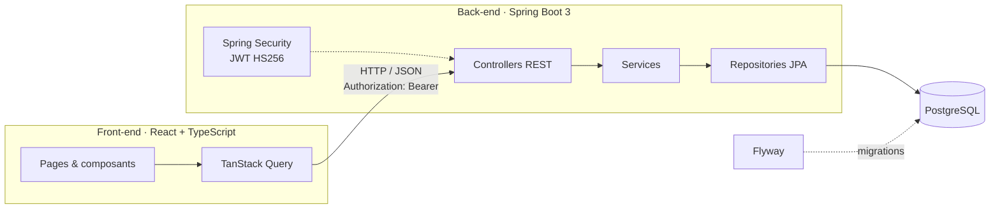

# ApplyTrack

Application web pour **suivre ses candidatures de stage et d'alternance** : un tableau kanban où chaque candidature avance de colonne en colonne, de l'envoi jusqu'à l'offre.

> 🚧 Projet en cours de développement. Voir la [feuille de route](#-feuille-de-route).

## ✨ Fonctionnalités

- **Comptes utilisateurs** : inscription, connexion, authentification sans état par JWT.
- **Kanban** : colonnes Envoyée → Relancée → Entretien → Offre / Refusée, avec **glisser-déposer**. La carte change de colonne tout de suite et revient à sa place si le serveur refuse le changement.
- **Candidatures** : entreprise, poste, lieu, lien de l'offre, date, notes. Chaque carte indique depuis combien de jours elle n'a pas bougé.
- **Cloisonnement des données** : un utilisateur ne peut ni lire ni modifier les candidatures d'un autre. C'est vérifié par des tests.
- **Documentation d'API** générée automatiquement (Swagger UI).

## 🏗️ Architecture



Le back est découpé par fonctionnalité (`auth`, `user`, `jobapplication`), avec dans chaque paquet les couches controller → service → repository et des DTO dédiés. Les entités JPA ne sortent jamais de l'API. Les erreurs suivent le format standard **RFC 9457** (`ProblemDetail`).

## 🛠️ Stack

| | |
|---|---|
| **Front-end** | React 19, TypeScript, Vite, TanStack Query, React Router, dnd-kit, Tailwind CSS |
| **Back-end** | Java 21, Spring Boot 3.5 (Web, Data JPA, Security, OAuth2 Resource Server, Validation), springdoc-openapi |
| **Base de données** | PostgreSQL 17, migrations Flyway |
| **Tests** | JUnit 5, MockMvc, **Testcontainers** (vraie base PostgreSQL), Vitest, Testing Library |
| **Outillage** | Docker, Docker Compose, GitHub Actions, oxlint |

## 🚀 Lancer le projet en local

Prérequis : **Java 21**, **Maven**, **Node.js 24** et **Docker**.

```bash
# 1. Base de données
docker compose up -d db

# 2. API (http://localhost:8080, doc sur /swagger-ui.html)
cd backend
mvn spring-boot:run

# 3. Front-end (http://localhost:5173)
cd frontend
npm install
npm run dev
```

Variables d'environnement de l'API (toutes ont une valeur par défaut pour le développement) :

| Variable | Rôle |
|---|---|
| `DATABASE_URL`, `DATABASE_USER`, `DATABASE_PASSWORD` | Connexion PostgreSQL |
| `JWT_SECRET` | Clé de signature des jetons, **32 caractères minimum**, obligatoire en production |
| `JWT_EXPIRATION` | Durée de validité des jetons (ISO-8601, `PT24H` par défaut) |
| `CORS_ALLOWED_ORIGINS` | URL(s) du front autorisées |

## 🧪 Tests

```bash
cd backend && mvn verify       # tests unitaires + tests d'intégration (Docker requis)
cd frontend && npm test        # tests Vitest
```

La CI GitHub Actions lance à chaque push le linter, la vérification des types, les tests et le build des deux applications, ainsi que la construction de l'image Docker de l'API.

## 📡 API

| Méthode | Route | Description |
|---|---|---|
| `POST` | `/api/auth/register` | Créer un compte |
| `POST` | `/api/auth/login` | Se connecter et obtenir un JWT |
| `GET` | `/api/auth/me` | Utilisateur connecté |
| `GET` | `/api/applications` | Lister ses candidatures |
| `POST` | `/api/applications` | Ajouter une candidature |
| `GET` · `PUT` · `DELETE` | `/api/applications/{id}` | Consulter, modifier ou supprimer |
| `PATCH` | `/api/applications/{id}/status` | Changer de colonne |

## 🗺️ Feuille de route

- [x] Authentification JWT, CRUD des candidatures, kanban en glisser-déposer
- [x] Tests d'intégration Testcontainers, CI GitHub Actions
- [ ] **Relances automatiques** : e-mail quand une candidature n'a pas bougé depuis X jours (tâche `@Scheduled`)
- [ ] **Tableau de bord** : taux de réponse, délai moyen, candidatures par semaine
- [ ] Recherche et filtres (entreprise, lieu, période)
- [ ] Tests de bout en bout Playwright
- [ ] Déploiement : API sur Render ou Fly.io, front sur Vercel, et lien de démo dans ce README
